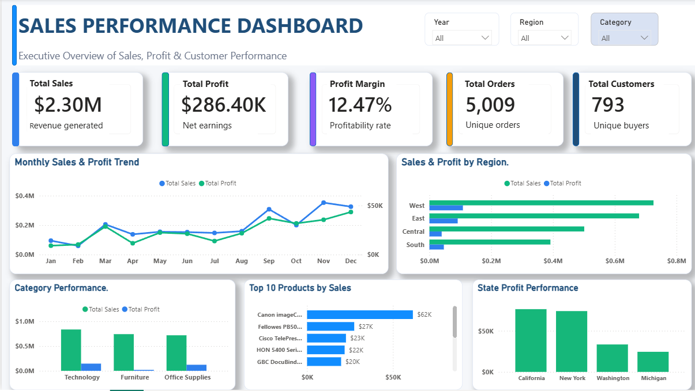

# Sales Performance Dashboard

An interactive Power BI dashboard built to analyse Superstore sales data and deliver actionable business insights on revenue, profit, products, customers, regions, and states.

## Project Objective

The objective of this project is to analyse real-world sales data, identify revenue trends, evaluate product and regional performance, understand customer purchasing behaviour, and present results through an interactive Power BI dashboard.

## Dashboard Preview

## Key Performance Indicators

| KPI | Value |
|---|---:|
| Total Sales | $2.30M |
| Total Profit | $286.40K |
| Profit Margin | 12.47% |
| Total Orders | 5,009 |
| Total Customers | 793 |

## Dashboard Features

- Interactive filters for Year, Region, and Category
- Monthly Sales and Profit Trend
- Sales and Profit by Region
- Category Performance
- Top 10 Products by Sales
- State Profit Performance
- KPI cards for Sales, Profit, Profit Margin, Orders, and Customers

## Data Cleaning and Preparation

The sales dataset was cleaned and prepared before analysis.

- Checked data types for dates, sales, profit, quantity, and discount.
- Reviewed missing and duplicate values.
- Created date-based fields including Order Year, Order Month, Order Quarter, and Shipping Days.
- Created KPI measures for Total Sales, Total Profit, Profit Margin, Total Orders, and Total Customers.
- Prepared cleaned data for Power BI reporting.

## Key Business Insights

- The business generated $2.30M in sales and $286.40K in profit.
- The West region is a major contributor to overall sales performance.
- Technology is a high-performing product category.
- Sales and profit vary by month, indicating seasonal trends.
- Top-selling products contribute significantly to revenue and should be prioritised for inventory availability.
- California, New York, Washington, and Michigan are among the strongest states by profit.
- Loss-making products, orders, or states should be reviewed for discounts, pricing, and shipping costs.

## Tools Used

- Power BI Desktop
- Python and Jupyter Notebook
- SQL
- CSV / Excel
- GitHub

## Project Structure

- `data/` - Raw and cleaned Superstore datasets
- `dashboard/` - Power BI dashboard file
- `images/` - Dashboard screenshot
- `notebooks/` - Jupyter Notebook source code
- `reports/` - Dashboard export and business insights report PDFs
- `sql/` - SQL analysis queries

## How to Use

1. Download or clone this repository.
2. Open `dashboard/PowerBI_Dashboard.pbix` in Power BI Desktop.
3. Use the Year, Region, and Category slicers to explore the dashboard.
4. Read `reports/business_insights_report.pdf` for detailed findings.